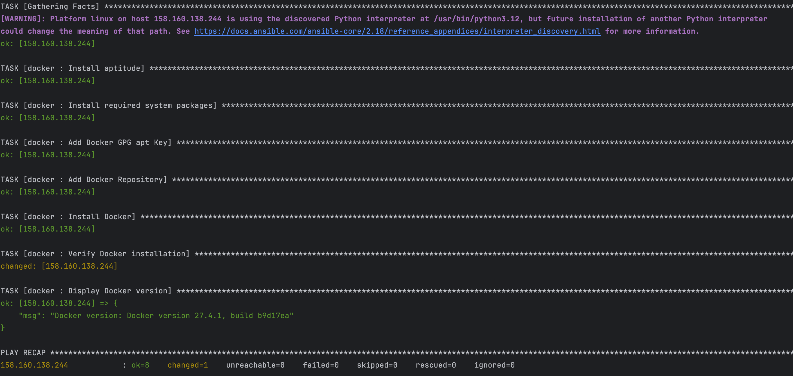

# Devops lab#2

- Создала роль 
```shell
ansible-galaxy init docker
```
- инициировала репозиторий и привязала его к удаленному
```shell
git init
git remote add origin https://gitlab.com/milamilamilamila2/devops.git
```
- заполнила метаданные в роли, закоммитила и запушила в репозиторий
```shell
git add *
git commit -m "add role"
git push --set-upstream origin master 
```
- создала рядом с playbook.yaml файл requirements.yaml
- прописала, откуда получить роль docker
- запустила playbook.yaml
```shell
ansible-galaxy role install -f -r requirements.yaml 
ansible-playbook playbook.yaml 
```
## Результат работы
